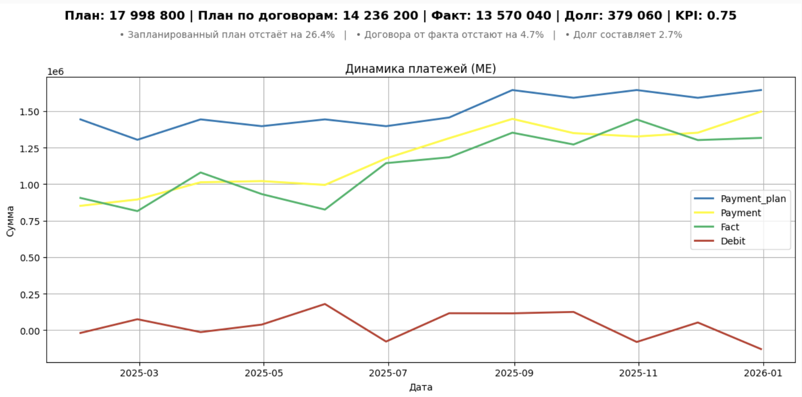
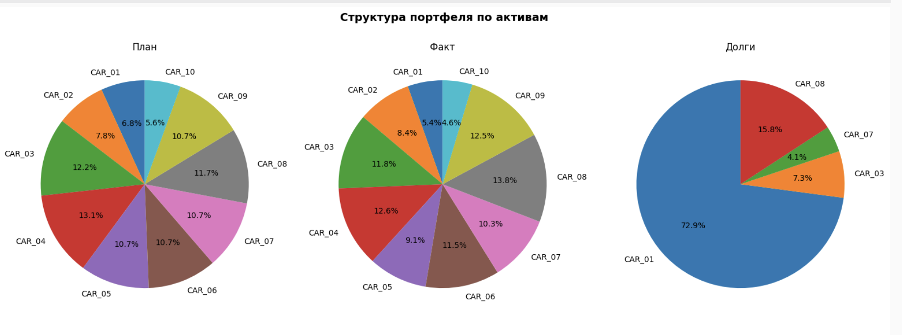
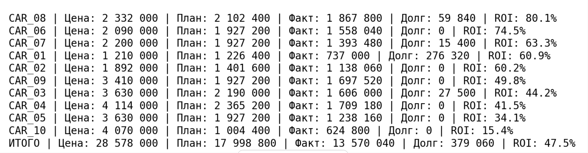

# Анализ доходности таксопарка

**Тип проекта:** аналитический pet-проект на основе реальной бизнес-модели аренды автомобилей.

## Описание проекта

В рамках проекта проведён анализ финансовой эффективности автопарка.  
Выполнено сравнение плановых и фактических денежных поступлений, рассчитан ROI по каждому автомобилю, выявлены проблемные и наиболее доходные активы.

## Бизнес-задачи
- Оценка общей доходности автопарка
- Анализ задолженности арендаторов
- Сравнение плановых и фактических показателей
- Выявление активов с наибольшими отклонениями
- Формирование управленческих рекомендаций

## 📊 Динамика платежей (2025)

## 🏗 Структура портфеля по активам

## 📈 Рейтинг активов по ROI

## Основные результаты
- Годовой ROI портфеля: **47.5%**
- Годовое отклонение план/факт: **−26.4%**
- Выявлены активы с критическим отклонением > 30%
- Предложена корректировка ценовой политики и плановой модели

## Выводы
- Плановая модель требует корректировки (завышенные ожидания)
- Необходим пересмотр ценовой политики по отдельным автомобилям
- Требуется контроль дебиторской задолженности
- Часть активов демонстрирует устойчивую прибыльность и может быть масштабирована

## Используемые инструменты

- Python (pandas, numpy)
- matplotlib / seaborn
- Jupyter Notebook
- Git
- Markdown

## 📂 Структура проекта

- `analysis.ipynb` — основной аналитический ноутбук с расчетами, KPI и визуализациями  
- `scripts.py` — вспомогательные функции (агрегация, расчёт отклонений, построение графиков)  
- `clear_data.ipynb` — ноутбук для обезличивания реальных данных перед публикацией  
- `processed/` — очищенные и подготовленные данные для анализа  
- `raw/` — исходная структура данных (без реальных значений)  
- `assets/` — скриншоты визуализаций для README  
- `README.md` — описание проекта

## Ограничения анализа

- Не учитываются операционные расходы
- Не учитывается инфляция
- Плановые значения не включают сезонность
- Не используется прогнозирование

## Использование проекта

### Для запуска анализа необходимо:
**cars.csv** — данные по автомобилям (id, purchase_price, purchase_date)
**operations.csv** — финансовые операции (type, car_id, date, amount)

### Описание ключевых полей:
**id / car_id** — идентификатор автомобиля
**purchase_price** — используется для расчёта ROI
**type** — тип операции (plan, fact, debit)
**amount** — сумма операции
### После загрузки данных:
При необходимости запустить **clear_data.ipynb**
Выполнить **analysis.ipynb**

